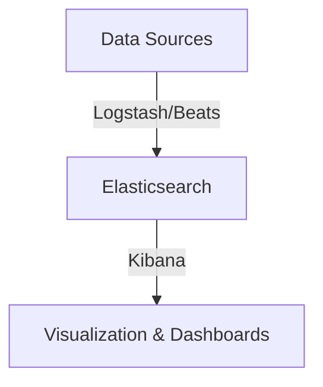

---
# try also 'default' to start simple
theme: default
# random image from a curated Unsplash collection by Anthony
# like them? see https://unsplash.com/collections/94734566/slidev
# background: https://cover.sli.dev
# some information about your slides (markdown enabled)
title: ElasticSearch & Kibana
info: |
  Elastic & Kibana
  Simion Ciprian Alin
# apply UnoCSS classes to the current slide
class: text-center
# https://sli.dev/features/drawing
drawings:
  persist: false
# slide transition: https://sli.dev/guide/animations.html#slide-transitions
transition: slide-left
# enable MDC Syntax: https://sli.dev/features/mdc
mdc: true
---

# Elastic & Kibana

Simion Ciprian Alin


--- 
layout: default
---

# What are Elastic & Kibana?

- **ElasticSearch** is a distributed, RESTful search and analytics engine capable of addressing a growing number of use cases.

- **Kibana** is a data visualization and exploration tool used for log and time-series analytics, application monitoring, and operational intelligence use cases.

--- 
layout: default
---

# Why use Elastic & Kibana?

<div class="flex flex-row gap-4 justify-center items-center w-full h-full text-2xl">
<div class="flex flex-col rounded-lg border-0.5 border-gray-500 p-4 gap-1 flex-1 bg-gray-600/30">
<mdi-file-outline />
 Log and event data analysis
</div>
<div class="flex flex-col rounded-lg border-0.5 border-gray-500 p-4 gap-1 flex-1 bg-gray-600/30">
<mdi-book-search-outline />
Full-text search capabilities
</div>
<div class="flex flex-col rounded-lg border-0.5 border-gray-500 p-4 gap-1 flex-1 bg-gray-600/30">
<mdi-chart-line />
Metrics and observability
</div>
</div>


---
layout: default
---

# The entire <span class="text-red-300">ELK</span> Stack

- <span class="text-red-300">E</span>lasticsearch
- <span class="text-red-300">L</span>ogstash
- <span class="text-red-300">K</span>ibana
- Beats

<!--   

- Elasticsearch: The core search and analytics engine.
- Logstash: A server-side data processing pipeline that ingests data from multiple sources simultaneously, transforms it, and then sends it to a "stash" like Elasticsearch.
- Kibana: A visualization layer that works on top of Elasticsearch, providing users with the ability to create and share dynamic dashboards.
- Beats: Lightweight data shippers that send data from edge machines to Logstash or Elasticsearch. - Elasticsearch: The core search and analytics engine.
-->

---
layout: default
---

# Data flow in ELK Stack



--- 
layout: default

---

# Architecture

- Cluster
- Node
- Index
- Document (JSON)
- Shard

<!--

- Cluster: A collection of one or more nodes (servers) that together hold your entire data and provide federated indexing and search capabilities across all nodes.
- Node: A single server that is part of the cluster, stores data, and participates in the cluster's indexing and search capabilities.
- Index: A collection of documents that have similar characteristics.
- Document: A basic unit of information that can be indexed. It is expressed in JSON format.
- Shard: A subset of an index that allows for horizontal scaling of data.

 -->


---
layout: default
---

# How does ElasticSearch work? (1)

- Inverted Index
- Analyzers 
- Tokenizers

<!--

- Inverted Index: A data structure used to store a mapping from content, such as words or numbers, to their locations in a database file, or in a document or a set of documents. This allows for fast full-text searches. Another thing to note is that Elasticsearch uses a variant of the inverted index called a "compressed inverted index" to optimize storage and search performance. It compresses the index data to reduce disk space usage while still allowing for efficient search operations. It achieves this by using techniques such as delta encoding and bit-packing. Which is efectively producing a mapping from terms to the documents that contain them. So in a way it is something like a bucketing system where each term points to a list of documents that contain that term. This only happend for certain data types like text and not for keyword or numeric fields.

- Analyzers: Components that process text during indexing and searching. They break down text into tokens and apply filters to normalize the tokens.
- Tokenizers: The part of the analyzer that breaks text into individual terms or tokens.

-->

---
layout: default
---

# How does ElasticSearch work? (2)

- Queries - DSL
- Relevance Scoring
- Distributed Search

<!--

- Queries - DSL: Elasticsearch uses a powerful and flexible query language called Query DSL (Domain Specific Language) to perform searches and aggregations on the data.
- Relevance Scoring: Elasticsearch uses a scoring algorithm to determine how well a document matches a given query, allowing for ranking of search results based on relevance.
- Distributed Search: Elasticsearch is designed to work in a distributed environment, allowing for horizontal scaling and high availability.

-->
---
layout: default
---

# Indexing

- Index Management
  - Dynamic Mapping
  - Explicit Mapping
<!--

- Index Management: The process of creating, updating, and deleting indices in Elasticsearch. This includes defining mappings for the fields in the documents.
  - Dynamic Mapping: Elasticsearch can automatically detect and add new fields to the index as documents are ingested.
  - Explicit Mapping: Users can define specific mappings for fields to control how data is indexed and searched.

-->

---
layout: two-cols-header 
transition: slide-left
---

# Aliases

::left::
- Index Aliases
- Write & Read Aliases


*Example of creating an alias:*

```json
POST /_aliases
{
  "actions": [
    {
      "add": {
        "index": "my_index_v1",
        "alias": "my_index"
      }
    }
  ]
}
```


::right::

*Example of searching using an alias:*

```json
GET /my_index/_search
{
  "query": {
    "match_all": {}
  }
}
```

<style>
.two-cols-header {
  column-gap: 20px; /* Adjust the gap size as needed */
}
</style>

<!--
- Index Aliases: An alias is a virtual index name that can point to one or more indices. This allows for easier management of indices and can be used to abstract the underlying index names.
- Write & Read Aliases: Aliases can be configured to handle read and write operations separately, allowing for more flexible data management and indexing strategies.
-->


---
layout: default
---

# Ingesting Data

- REST API
- Logstash
- Beats


*Example using REST API to index a document:*
```bash
curl -X POST "localhost:9200/my_index/_doc/" -H 'Content-Type: application/json' -d'
{
  "field_name": "field_value"
}
```


<!--
- Ingesting Data: The process of adding data to Elasticsearch. This can be done through various methods:
  - REST API: Elasticsearch provides a RESTful API for indexing and searching data.
  - Logstash: A data processing pipeline that can ingest data from various sources and send it to Elasticsearch.
  - Beats: Lightweight data shippers that can send data from edge machines to Elasticsearch. 

-->
---
layout: two-cols-header
---

# Querying Data
::left::
- Match Query

```json
{
  "query": {
    "match": {
      "field_name": "search text"
    }
  }
}
```

- Term Query

```json
{
  "query": {
    "term": {
      "field_name": "exact_value"
    }
  }
}
```
::right::

- Bool Query

```json
{
  "query": {
    "bool": {
      "must": [
        { "match": { "field1": "value1" } },
        { "term": { "field2": "value2" } }
      ],
      "must_not": [
        { "term": { "field3": "value3" } }
      ]
    }
  }
}
```

<style>
.two-cols-header {
  column-gap: 20px; /* Adjust the gap size as needed */
}
</style>

<!--

  - Match Query: A full-text search query that analyzes the input text and matches it against the indexed documents.
  - Term Query: A precise search query that looks for exact matches of a term in a specific field.
  - Bool Query: A compound query that combines multiple queries using boolean logic (must, should, must_not).

-->

---
layout: two-cols-header

---


# Query Example 1
- `match` Query Example

::left::

__query:__
```json
GET /my_index/_search
{
  "query": {
    "match": {
      "field_name": "search text"
    }
  }
}
```

::right::
__result:__

```json
{
  "hits": {
    "total": 1,
    "hits": [
      {
        "_source": {
          "field_name": "search text"
        }
      }
    ]
  }
}
```

<style>
.two-cols-header {
  column-gap: 20px; /* Adjust the gap size as needed */
}
</style>
---
layout: two-cols-header
---

# Query Example 2

- `term` Query Example
::left::
__query:__

```json
GET /my_index/_search
{
  "query": {
    "term": {
      "field_name": "exact_value"
    }
  }
}
```


::right::

__result:__
```json
{
  "hits": {
    "total": 1,
    "hits": [
      {
        "_source": {
          "field_name": "exact_value"
        }
      }
    ]
  }
}
```

<style>
.two-cols-header {
  column-gap: 20px; /* Adjust the gap size as needed */
}
</style>

---
layout: default
---
# Data Aggregation

- Metric - `sum`, `avg`, `min`, `max`
- Bucket - `terms`, `range`, `date_histogram`
- Pipeline 
<!--
- Aggregations: A powerful feature in Elasticsearch that allows for data analysis and summarization:
  - Metric Aggregations: Perform calculations on numeric fields, such as sum, average, min, and max.
  - Bucket Aggregations: Group documents into buckets based on certain criteria, such as terms, ranges, or date histograms. 
  - Pipeline Aggregations: Perform operations on the results of other aggregations, such as calculating moving averages or derivatives.
-->


---
layout: two-cols-header
---

# Aggregation Example

- `avg` Metric Aggregation Example
::left::


__query:__
```json
GET /my_index/_search
{
  "size": 0,
  "aggs": {
    "my-agg-name": {
      "avg": {
        "field": "numeric_field"
      }
    }
  }
}
```
::right::

__result:__
```json
{
  "took": 10,
  "timed_out": false,
  "hits": {
    "total": 100,
    "max_score": null,
    "hits": [...]
  },
  "aggregations": {
    "my-agg-name": {
      "value": 42.5
    }
  }
}
```

<style>
.two-cols-header {
  column-gap: 20px; /* Adjust the gap size as needed */
}
</style>


---
layout: default
---

# Data management Policies in ElasticSearch
- Data Stream Policies
- Index Lifecycle Management (ILM)
- Snapshot & Restore

*Example of 4 phases of data*


<!--
- Data Steam Policies: Define how data is processed and ingested into Elasticsearch.
- Index Lifecycle Management (ILM): Automate the management of indices over their lifecycle, including rollover, deletion, and optimization.
- Snapshot & Restore (SLM): Create backups of indices and restore them when needed.
-->

--- 
layout: two-cols-header
---

# Index Lifecycle Management Example

::left::

We first create an ILM policy:
+ Define phases (hot, warm, cold, delete)
+ Assign actions to each phase

::right::
__Example JSON:__
```json
PUT _ilm/policy/my_policy
{
  "policy": {
    "phases": {
      "hot": {
        "actions": {
          "rollover": {  "max_size": "50gb", "max_age": "7d"}
        }
      },
      "delete": {
        "min_age": "30d",
        "actions": {"delete": {}}
      }
    }
  }
}
```

--- 
layout: two-cols-header
transition: slide-up
---

# Applying ILM Policy to an Index Template

::left::

We then create an index template that uses the ILM policy:
+ Define index patterns
+ Set lifecycle settings

::right::
__Example JSON:__
```json
PUT _index_template/my_template
{
  "index_patterns": ["my_index-*"],
  "template": {
    "settings": {
      "index.lifecycle.name": "my_policy",
      "index.lifecycle.rollover_alias": "my_index"
    }
  }
}
```
---
layout: cover
---

# Kibana

---
layout: image

image: images/kibana1.png
backgroundSize: 60% 

---


# Discover (Vizualization)

<!--

- Visualization: Kibana provides various visualization options such as bar charts, line graphs, pie charts, and maps to represent data stored in Elasticsearch.
-->
---
layout: image

image: images/kibana2.png
backgroundSize: 50% 

---

# Dashboards
<!--

- Dashboards: Users can create and customize dashboards by combining multiple visualizations to get a comprehensiv view of their data.
-->
---
layout: image

image: images/kibana3.png
backgroundSize: 55% 

---

# Management

<!--

- Management: Kibana offers management tools for configuring index patterns, saved objects, and other settings.
-->
---
layout: image

image: images/kibana4.png
backgroundSize: 60% 
---
# Dev Tools

<!--
- Dev Tools: A built-in console in Kibana that allows users to interact with the Elasticsearch REST API directly.
-->


---
layout: statement
---

# Grafana + ElasticSearch = ❤️

---
layout: default
---

# Documentation & Resources
- [Elastic Documentation](https://www.elastic.co/docs)
- [Kibana Documentation](https://www.elastic.co/guide/en/kibana/current/index.html)
- [Elastic Blog](https://www.elastic.co/blog/)
- [Elastic YouTube Channel](https://www.youtube.com/c/Elastic)


---
transition: slide-up
layout: end
--- 

# Thank you! 
## Q&A

