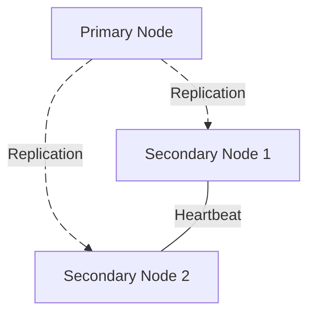

---
# try also 'default' to start simple
theme: default
# random image from a curated Unsplash collection by Anthony
# like them? see https://unsplash.com/collections/94734566/slidev
# background: https://cover.sli.dev
# some information about your slides (markdown enabled)
title: MongoDB
info: |
  MongoDB
  Simion Ciprian Alin
# apply UnoCSS classes to the current slide
class: text-center
# https://sli.dev/features/drawing
drawings:
  persist: false
# slide transition: https://sli.dev/guide/animations.html#slide-transitions
transition: slide-left
# enable MDC Syntax: https://sli.dev/features/mdc
mdc: true
---

# MongoDB

Simion Ciprian Alin


---
transition: fade
layout: center

---


MongoDB is a NoSQL, document-oriented database designed to handle unstructured or semi-structured data, often in large volumes and with high scalability needs. Instead of using tables and rows like a traditional relational database, MongoDB stores data in flexible, JSON-like documents within collections.


---
transition: slide-up
layout: fact

---


# No<span class="text-red-300">SQL</span>
<div class="flex flex-row justify-center">
<p>No  <span class="text-red-300">S</span>tructured <span class="text-red-300">Q</span>uery <span class="text-red-300">L</span>anguage</p>
</div>


---
transition: slide-up
layout: fact

---

# Relational or Non-Relational

What does relational even mean?

---
transition: slide-up

layout: fact

---

# JSON Documents 
JavaScript Object Notation
(ackchually BSON)
maxSize 16MB


---
transition: slide-up

class: text-start 

---

# JSON vs BSON - 1

<!-- | <div class="text-2xl font-extrabold"> JSON </div>| <div class="text-2xl font-extrabold"> BSON </div> |
|---------------------|-------------------|
| String              | MinKey             |
| Number              | 12.MaxKey           |
| Object (JSON Object)| Binary Data               |
| Array               | ObjectId              |
| Boolean             | Regular Expression               |
| Null                | Javascript Code               |
|                     | Decimal128               |
|                     | Date               | -->

<div class="grid grid-cols-3 gap-4">

<div>
    <div class="text-2xl font-extrabold"> JSON </div>
    - String <br>
    - Number <br>
    - Object (JSON object) <br>
    - Array <br>
    - Boolean <br>
    - Null

</div>


<div>
   <div class="text-2xl font-extrabold"> BSON </div>
    [JSON FIELDS]
    + <br>
    - Minkey <br>
    - Maxkey <br>
    - Binary Data <br>
    - ObjectID <br>
    - Regular Expression <br>
    - JavaScript code <br>
    - Decimal128 <br>
    - Date
</div>

</div>

---
transition: slide-up

class: text-start 
lines: true
---

# JSON vs BSON - 2

- JSON human readable, but slow for processing
- BSON not human readable, making it faster for machines to parse and generate


JSON example:
```json
 {
    "hello": "world"
 }

```

Corresponding BSON representation:
``` {all|1|2|3|4|5|all}{lines:true}
\x16\x00\x00\x00                // total document size
\x02                            // type String
hello                           // field name
\x00\x06\x00\x00\x00world\x00   // field value (size of value, value, null terminator)
\x00                            // end of document
```

---
transition: slide-left

layout : default
lines: true
---

# Terminology
<br>
<br>
<br>
<div class="grid grid-cols-2 gap-4">

<div>
<div class="flex flex-col items-center justify-center">

<div class="text-2xl font-extrabold"> SQL </div>

<br>
<div class="text-xl"> Databases </div>
<arrow x2="600" y2="240" x1="370" y1="240" color="#444" width="2" arrowSize="2" />

<br>
<div class="text-xl"> Tables </div>
<arrow x2="600" y2="300" x1="370" y1="300" color="#444" width="2" arrowSize="2" />

<br>
<div class="text-xl"> Rows </div>
<arrow x2="600" y2="355" x1="370" y1="355" color="#444" width="2" arrowSize="2" />

<br>
<div class="text-xl"> Columns </div>
<arrow x2="600" y2="410" x1="370" y1="410" color="#444" width="2" arrowSize="2" />
    
</div>
</div>
<div class="flex flex-col items-center justify-center">
<div>
<div class="text-2xl font-extrabold"> MongoDB </div>

<br>
<div class="text-xl"> Databases </div>
<br>
<div class="text-xl"> Collections </div>
<br>
<div class="text-xl"> Documents </div>
<br>
<div class="text-xl"> Fields </div>
</div>
    
</div>

</div>

---
transition: slide-left

class: text-start 
lines: true
---

# Schema
<br>
<br>
<br>
<br>
<div class="grid grid-cols-2 gap-4">

<div class="flex flex-col items-center justify-center">

<div class="text-2xl font-extrabold"> SQL </div>

<br>
<div class="text-xl"> Necessary </div>

<br>
<div class="text-xl"> Strict </div>

</div>


<div class="flex flex-col items-center justify-center">
<div class="text-2xl font-extrabold"> MongoDB </div>

<br>
<div class="text-xl"> Optional </div>

<br>
<div class="text-xl"> Flexible </div>

</div>

</div>

---
transition: slide-left

class: text-start
lines: true
---

# Schema
- Not necessary to define the schema before inserting data (vs SQL)
- Different documents in the same collection 
- Different field types for the same field
- Easier to evolve the data model over time
- More flexibility for developers
- <span v-mark.red="1">Potential</span> for data inconsistency if not managed properly

---
transition: slide-up

class: text-start 

---

# Create

<div class="grid grid-cols-2 gap-4"> 
<div>

- Insert One
```javascript
 db.users.insertOne({
    name: "John Doe",
    age: 30,
    email: "", 
    profile: {
        bio: "Software developer",
        interests: ["coding", "music", "gaming"]
    }
});
{ 
    acknowledged: true,
    insertedId: ObjectId("64b7f0c2e1d3c8b5f6a7e9d1")
}
```
</div>

<div>

- Insert Many
```javascript
 db.users.insertMany([
    {
        name: "Jane Smith",
        age: 25,
        email: "", 
    },
    {
        name: "Alice Johnson",
        age: 28,
        email: "", 
    }
]);
{ 
    acknowledged: true,
    insertedIds: [
        ObjectId("64b7f0c2e1d3c8b5f6a7e9d2"),
        ObjectId("64b7f0c2e1d3c8b5f6a7e9d3")
    ]
}
```
</div>

</div>


---
transition: slide-up

class: text-start 

---

# Read

<div class="grid grid-cols-2 gap-4"> 
<div>

- Find One
```javascript
    db.users.findOne({
        name: "John Doe"
    });
    {
        _id: ObjectId("64b7f0c2e1d3c8b5f6a7e9d1"),
        name: "John Doe",
        age: 30,
        email: "",
        profile: {
            bio: "Software developer",
            interests: ["coding", "music", "gaming"]
        }
    }
```
</div>

<div>

- Find One and Update
```javascript
    db.users.findOneAndUpdate(
        { name: "John Doe" },
        { $set: { age: 31 } },
        { returnNewDocument: true }
    );
    {
        _id: ObjectId("64b7f0c2e1d3c8b5f6a7e9d1"),
        name: "John Doe",
        age: 31,
        email: "",
        profile: {
            bio: "Software developer",
            interests: ["coding", "music", "gaming"]
        }
    }
```
</div>

</div>

---
transition: slide-up

class: text-start 

---
# Update

<div class="grid grid-cols-2 gap-4"> 
<div>

- Update One
```javascript
    db.users.updateOne(
        { name: "John Doe Doe" },
        { $set: { age: 31 } }
    );
    {
        acknowledged: true,
        insertedId: ObjectId("64b7f0c2e1d3c8b5f6a7e9d1"),
        matchedCount: 0,
        modifiedCount: 0,
        upsertedCount: 1
    }
```
</div>

<div>

- Update Many
```javascript
    db.users.updateMany(
        { age: { $lt: 30 } },
        { $set: { status: "young" } }
    );
    {
        acknowledged: true,
        insertedId: null,
        matchedCount: 2,
        modifiedCount: 2,
        upsertedCount: 0
    }
```
</div>

</div>

---
transition: slide-up

class: text-start 

---
# Delete

<div class="grid grid-cols-2 gap-4"> 
<div>

- Delete One
```javascript
    db.users.deleteOne(
        { name: "John Doe" }
    );
    {
        acknowledged: true,
        deletedCount: 1
    }
```
</div>

<div>

- Delete Many
```javascript
    db.users.deleteMany(
        { age: { $lt: 30 } }
    );
    {
        acknowledged: true,
        deletedCount: 2
    }
```
</div>

</div>


---
transition: slide-up

class: text-start 

---
# Additional Operations - 1

<div class="grid grid-cols-1 gap-4"> 
<div>

- Count Documents
```javascript
    db.users.countDocuments(
        { status: "active" }
    );
    42
```


- Limit 
```javascript
    db.users.find(
        { status: "active" }
    ).limit(10);
    [ /* first 10 active users */ ]
```

- Skip

```javascript
    db.users.find(
        { status: "active" }
    ).skip(5).limit(10);
    [ /* active users 6 to 15 */ ]
```
</div>


</div>

---
transition: slide-up

class: text-start 

---
# Additional Operations - 2

<div class="grid grid-cols-1 gap-4"> 
<div>

- Sort
```javascript
    db.users.find(
        { status: "active" }
    ).sort({ age: -1 });
    [
        {
            name: "Alice Johnson",
            age: 35,
            status: "active"
        },
        {
            name: "John Doe",
            age: 30,
            status: "active"
        }
    ]
```
</div>


</div>


---
transition: slide-up

class: text-start 

---
# Additional Operations - 3

<div class="grid grid-cols-2 gap-4"> 
<div>

- Projection Additive
```javascript{all|4|all}{lines:true}
    db.users.find(
        { status: "active" },
        { name: 1, age: 1, _id: 0 }
    ).projection({ name: 1, age: 1});
    
    [
        {
            name: "John Doe",
            age: 30
        },
        {
            name: "Jane Smith",
            age: 25
        }
    ]
```

</div>

<div>

- Projection Negative
```javascript{all|4,8,9|all}{lines:true}
    db.users.find(
        { status: "active" },
        { name: 1, age: 1, _id: 0 }
    ).projection({ name: 0 });
    
    [
        {
            age: 30,
            status: "active"
        },
        {
            age: 25,
            status: "active"
        }
    ]
```

</div>


</div>

---
transition: slide-up

class: text-start 

---
# Operators - Comparison

<div class="grid grid-cols-2 gap-y-8 gap-x-4"> 
<div class="w-fit">

- <code>$eq</code> : Equal To
```javascript
{ age: { $eq: 30 } }
```
</div>
<div class="w-fit">
- <code>$ne</code> : Not Equal To
```javascript
{ age: { $ne: 30 } }
```
</div>
<div class="w-fit">
- <code>$gt</code> : Greater Than
```javascript
{ age: { $gt: 30 } }
```
</div>
<div class="w-fit">
- <code>$gte</code> : Greater Than or Equal To
```javascript
{ age: { $gte: 30 } }
```
</div>
<div class="w-fit">
- <code>$lt</code> : Less Than
```javascript
{ age: { $lt: 30 } }
```
</div>
<div class="w-fit">
- <code>$lte</code> : Less Than or Equal To
```javascript
{ age: { $lte: 30 } }
```
</div>

<div class="w-fit">
- <code>$in</code> : In Array
```javascript
{ age: { $in: [25, 30, 35] } }
```
</div>  
<div class="w-fit">
- <code>$nin</code> : Not In Array
```javascript
{ age: { $nin: [25, 30, 35] } }
```
</div>


</div>

---
transition: slide-up

class: text-start 

---
# Operators - Logical

<div class="grid grid-cols-1 gap-6"> 

<div class="w-fit">
- <code>$and</code>: Logical AND
```javascript
{ $and: [ { age: { $gt: 25 } }, { age: { $lt: 35 } } ] }
```
</div>

<div class="w-fit">
- <code>$or</code>: Logical OR
```javascript
{ $or: [ { age: { $lt: 25 } }, { age: { $gt: 35 } } ] }
```
</div>

<div class="w-fit">
- <code>$not</code>: Logical NOT
```javascript
{ age: { $not: { $gt: 30 } } }
```
</div>

<div class="w-fit">
- <code>$nor</code>: Logical NOR
```javascript
{ $nor: [ { age: { $lt: 25 } }, { age: { $gt: 35 } } ] }
```
</div>


</div>

---
transition: slide-up

class: text-start 

---
# Operators - Evaluation

<div class="grid grid-cols-1 gap-6"> 

<div class="w-fit">
- <code>$regex</code>: Regular Expression
```javascript
{ name: { $regex: "John", $options: "i"} }
```
</div>

<div v-click class="w-fit">
- <code>$exists</code>: Field Existence
```javascript
{ email: { $exists: true } }
```
</div>

<div v-click="2" class="w-fit">
- <code>$mod</code>: Modulus
```javascript
{ age: { $mod: [5, 0] } }
```
</div>

<div v-click="3" class="w-fit">
- <code>$text</code>: Text Search
```javascript
{ $text: { $search: "developer" } }
```
</div>

<div v-click="4" class="w-fit">
- <code>$where</code>: JavaScript Expression
```javascript
{ $where: "this.age > 25 && this.age < 35" }
```
</div>


</div>

---
transition: slide-up

class: text-start 

---
# Operators - Array

<div class="grid grid-cols-1 gap-6"> 

<div class="w-fit">
- <code>$all</code>: All Elements Match
```javascript
{ interests: { $all: ["coding", "music"] } }
```
</div>

<div v-click class="w-fit">
- <code>$elemMatch</code>: Element Match
```javascript
{ profile: { $elemMatch: { interests: "coding" } } }
```
</div>

<div v-click="2" class="w-fit">
- <code>$size</code>: Array Size
```javascript
{ interests: { $size: 3 } }
```
</div>

</div>


---
transition: slide-up

class: text-start 

---
# Aggregation - Lookup - "Join"

<div class="grid grid-cols-1 gap-6"> 

<div class="grid grid-cols-2 gap-4">
<div class="text-xs">
    <div class="text-xl "> Orders </div>

| _id | customerId | amount |
|-----|------------|--------|
| 1   | 101        | 250    |
| 2   | 102        | 450    |
| 3   | 101        | 300    |

</div>
<div class="text-xs">
    <div class="text-xl "> Users </div>

| _id | name        | email              |
|-----|-------------|--------------------|
| 101 | John Doe    |                    |
| 102 | Jane Smith  |                    |
| 103 | Alice Johnson |                    |

</div>

<div v-click>
```javascript
    db.orders.aggregate([
        {
            $lookup: {
                from: "users",
                localField: "customerId",
                foreignField: "_id",
                as: "customerDetails"
            }
        }
    ]);
```
</div>

<div v-click="2">

```json
[ 
    {
        _id: 1,
        customerId: 101,
        amount: 250,
        customerDetails: [
            {
                _id: 101,
                name: "John Doe",
                email: ""
            }
        ]
    },
    [/* more orders */]
]
``` 
</div>

<arrow v-click=2 x1="360" y1="450" x2="550" y2="450" color="#712" width="5" />

</div>

</div>


---
transition: slide-up

class: text-start 

---
# Aggregation - Group 

<div class="grid grid-cols-1 gap-6"> 

<div class="grid grid-cols-2 gap-4">

<div>
```javascript
    db.orders.aggregate([
        {
            $group: {
                _id: "$customerId",
                totalAmount: { $sum: "$amount" },
                orderCount: { $sum: 1 }
            }
        }
    ]);
```
</div>

<div v-click>

```json
[ 
    {
        _id: 101,
        totalAmount: 550,
        orderCount: 2
    },
    {
        _id: 102,
        totalAmount: 450,
        orderCount: 1
    }
]
``` 
</div>

</div>

</div>

---
transition: slide-left

class: text-start 

---
# Migrations - ish

- No schema, so migrate what?

- Update Many + $set / $unset

<div class="w-fit">
```javascript
    db.users.updateMany(
        { age: { $exists: false } },
        { $set: { age: 0 } }
    );
```
</div>


---
transition: slide-left

layout: two-cols

---
# Replica Sets

- High Availability and Data Redundancy
- Automatic Failover and Recovery
- Read Scalability
- Data Consistency
- Change Streams

::right::
<br>
<br>
<br>



---
transition: slide-left

layout: default


---
# Sharding

<br>

- What is Sharding?
- Why use Sharding?
- Shard Key
- Types of Sharding
    - Range-Based Sharding
    - Hash-Based Sharding
    - Zone-Based Sharding


---
transition: slide-left

class: text-start
lines: true
---

# Mongo Software Ecosystem
 
- Mongo Atlas - cloud deployment of mongo 
    - https://www.mongodb.com/atlas
- Mongo Server - self hosted mongo server
    - https://www.mongodb.com/try/download/community
- Mongo Compass - GUI for a mongo deployment
    - https://www.mongodb.com/products/tools/compass
- Mongo VSCode extension (for playgrounds)
    - https://marketplace.visualstudio.com/items?itemName=mongodb.mongodb-vscode
- Docker Image
    - https://hub.docker.com/_/mongo
- MongoSH - mongo shell

