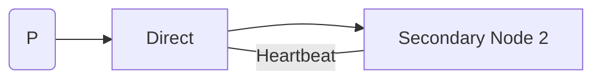

---
# try also 'default' to start simple
theme: default
# random image from a curated Unsplash collection by Anthony
# like them? see https://unsplash.com/collections/94734566/slidev
# background: https://cover.sli.dev
# some information about your slides (markdown enabled)
title: Rabbit, Prometheus & Grafana
info: |
  Rabbit, Prometheus & Grafana
  Simion Ciprian Alin

# apply UnoCSS classes to the current slide
class: text-center
# https://sli.dev/features/drawing
drawings:
  persist: false
# slide transition: https://sli.dev/guide/animations.html#slide-transitions
transition: slide-left
# enable MDC Syntax: https://sli.dev/features/mdc
mdc: true
---

# Rabbit, Prometheus & Grafana

Simion Ciprian Alin

---
transition: slide-up

---

# Intro

- RabbitMQ - Message Broker
- Prometheus - Monitoring & Alerting
- Grafana - Visualization & Analytics

---
transition: slide-up

--- 

# Why?

- Distributed Systems
- Server performance monitoring and debugging
- Support for scalabale applications

---
transition: slide-up

---

# Rabbit Message Queue

- Producer 
- Exchange
- Queue
- Receiver (Consumer)

---
transition: slide-up

--- 

# RabbitMQ - Exchange

- 4 types of exchanges:
  - Direct
  - Topic
  - Headers
  - Fanout

- Binding 

---
transition: slide-up
layout: two-cols
--- 

# RabbitMQ - Exchange - Direct

- Routing Key 
- Multiple Bindings - Fanout

<!-- ::right:: -->
 
 

